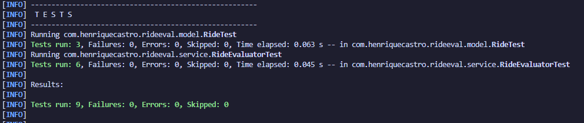
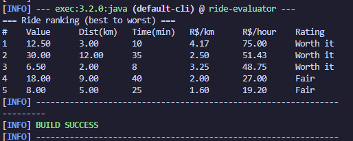

# Avaliador de Corridas 🚗


Ferramenta de linha de comando, em **Java 21 puro** (sem framework), que avalia e ranqueia
ofertas de corrida para motoristas de aplicativo — ajudando a decidir, em segundos, qual
corrida realmente vale a pena aceitar.

Para cada corrida, o programa calcula **R$/km** e **R$/hora**, classifica como
`Worth it` / `Fair` / `Bad` com base em limites configuráveis, e imprime a lista
ordenada da melhor para a pior.

---

## 📑 Sumário

- [Sobre o projeto](#-sobre-o-projeto)
- [Funcionalidades](#-funcionalidades)
- [Tecnologias](#-tecnologias)
- [Estrutura do projeto](#-estrutura-do-projeto)
- [Como executar](#-como-executar)
- [Exemplo de saída](#-exemplo-de-saída)
- [Como funciona a classificação](#-como-funciona-a-classificação)
- [Decisões técnicas](#-decisões-técnicas)
- [Testes](#-testes)
- [Próximos passos](#-próximos-passos)
- [Autor](#-autor)

---

## 📌 Sobre o projeto

Projeto de portfólio focado em **back-end**. O objetivo não é apenas um CLI que funciona,
mas código **limpo e idiomático em Java**, com separação clara entre a lógica de negócio e a
entrada/saída, além de testes unitários cobrindo as regras de avaliação.

## ✨ Funcionalidades

- Cálculo de **R$/km** e **R$/hora** por corrida.
- Classificação em **`Worth it`**, **`Fair`** ou **`Bad`** por limites configuráveis.
- **Ranqueamento** das corridas da melhor para a pior.
- Saída em **tabela legível** no terminal.
- Validação dos dados de entrada (distância e tempo positivos, valor não negativo).

## 🛠 Tecnologias

| Tecnologia | Uso |
|------------|-----|
| Java 21    | Linguagem (records, enums, streams, Optional) |
| Maven      | Build e gerenciamento de dependências |
| JUnit 5    | Testes unitários |

## 📂 Estrutura do projeto

```
src/main/java/com/henriquecastro/rideeval/
├── Main.java                       # ponto de entrada: monta os dados, avalia e imprime
├── model/
│   ├── Ride.java                   # dado de entrada (record): value, distanceKm, durationMin
│   ├── RideAnalysis.java           # resultado calculado (record): + R$/km, R$/hora, rating
│   └── Rating.java                 # classificação (enum): WORTH_IT / FAIR / BAD
├── service/
│   ├── RideEvaluator.java          # lógica: calcula, classifica e ranqueia
│   └── EvaluationThresholds.java   # limites de classificação configuráveis (record)
└── cli/
    └── RidePrinter.java            # formatação/saída no terminal, isolada da lógica
```

## ▶ Como executar

### Pré-requisitos

- **JDK 21+**
- **Maven 3.9+**

Verifique a instalação:

```bash
java -version
mvn -version
```

### Rodar a aplicação

A partir da raiz do projeto:

```bash
mvn compile exec:java
```

### Rodar os testes

```bash
mvn test
```

## 🖥 Exemplo de saída

```
=== Ride ranking (best to worst) ===
#    Value      Dist(km)   Time(min)   R$/km      R$/hour    Rating
1    12.50      3.00       10          4.17       75.00      Worth it
2    30.00      12.00      35          2.50       51.43      Worth it
3    6.50       2.00       8           3.25       48.75      Worth it
4    18.00      9.00       40          2.00       27.00      Fair
5    8.00       5.00       25          1.60       19.20      Fair
```

<!-- Print sugerido do app em execução (instruções no fim do README) -->


## 📊 Como funciona a classificação

A nota é definida pelo **R$/hora** (o que mais importa para o tempo do motorista),
usando os limites padrão em `EvaluationThresholds`:

| R$/hora | Classificação |
|---------|---------------|
| ≥ 30,00 | `Worth it`    |
| ≥ 18,00 | `Fair`        |
| < 18,00 | `Bad`         |

Os limites são injetados no `RideEvaluator`, então é possível alterá-los sem mexer na lógica.

## 🧠 Decisões técnicas

- **`record` para dados (`Ride`, `RideAnalysis`, `EvaluationThresholds`)** — tipos de valor
  imutáveis e sem boilerplate. `Ride` é a entrada crua; `RideAnalysis` é o resultado
  calculado, mantidos separados para que o cálculo nunca altere a entrada.

- **`enum` para `Rating`** — conjunto fixo e tipado de categorias, com o rótulo de exibição
  embutido em cada constante.

- **Lógica separada da entrada/saída** — `RideEvaluator` não tem `System.out`/`Scanner`,
  o que o torna totalmente testável. `RidePrinter` concentra toda a saída e poderia ser
  trocado por uma camada gráfica/web sem tocar na lógica.

- **Streams + `Comparator` para o ranking** — `analyzeAll` mapeia cada corrida para sua
  análise e ordena (maior R$/hora primeiro, R$/km como critério de desempate).

- **`Optional<RideAnalysis>` em `findBest`** — torna explícita a ausência de resultado,
  em vez de retornar `null`.

- **Limites configuráveis em `EvaluationThresholds`** — evita números mágicos e facilita
  testar os casos de fronteira.

- **Sem pattern forçado** — um Strategy para "critérios diferentes" seria abstração
  prematura com um único critério. Pode ser extraído depois, se surgir um segundo critério.

- **Valores monetários como `double`** — o app calcula apenas razões de comparação, não
  contabilidade. Para dinheiro de verdade (arredondamento, moeda) `BigDecimal` seria o certo.

## ✅ Testes

São **9 testes** cobrindo o núcleo da aplicação: o cálculo das métricas, cada faixa de
classificação, os limites inclusivos (exatamente 30 e 18 R$/hora), a ordenação do ranking
e a validação de entrada do `Ride`.

```bash
mvn test
```

<!-- Print sugerido dos testes passando (instruções no fim do README) -->


## 🚀 Próximos passos

- Ler as corridas de um arquivo ou da entrada do terminal.
- Persistência em arquivo (CSV/JSON).
- Exportar o ranking.

## 👤 Autor

**Henrique Castro** — [GitHub](https://github.com/HenriqueCastro18)
